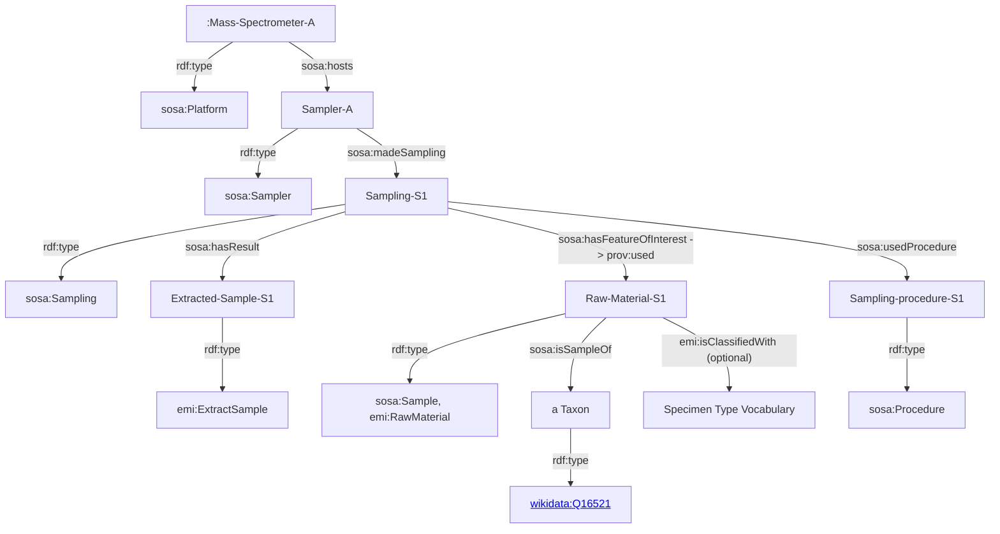

# This is PMA's DBGI daily open-notebook.

Today is 2023.09.01

## Todo today

### Have a look at the DBGI discussion forum
    - https://github.com/orgs/digital-botanical-gardens-initiative/discussions
###
###

## Doing

[[EMI.Semantic-model]]

Working on the EMI semantic model at [[EMI.Semantic-model]]

Checking if the mermaid format used by Tarcisio can be used to draft the model directly in dendron notes

https://www.w3.org/TR/vocab-ssn/#intro

https://github.com/w3c/sdw-sosa-ssn

The Semantic Sensor Network (SSN) ontology is an ontology for describing sensors and their observations, the involved procedures, the studied features of interest, the samples used to do so, and the observed properties, as well as actuators. SSN follows a horizontal and vertical modularization architecture by including a lightweight but self-contained core ontology called SOSA (Sensor, Observation, Sample, and Actuator) for its elementary classes and properties. With their different scope and different degrees of axiomatization, SSN and SOSA are able to support a wide range of applications and use cases, including satellite imagery, large-scale scientific monitoring, industrial and household infrastructures, social sensing, citizen science, observation-driven ontology engineering, and the Web of Things. Both ontologies are described below, and examples of their usage are given.

## Paused

## Done

## Notes

### Discussion with Donat

Present: Donat, Guido Sautter, Felipe Simoes

- On ants

https://scholar.google.com/citations?user=mr4ptE4AAAAJ&hl=en&oi=ao

Morgan

http://antbase.org/agosticv_2003.html

Gökçen, O.A., Morgan, D.E., Dani, F.R., Agosti,D., Wehner, R., 2002. Dufour gl contents of ants of the Cataglyphisbicolor group. Journal of Chemical Ecology 28 (1), 71-87.

#### Phytochem

- Issues form 100 - 208
- 1400 left to process
- 900 papers in TreatmentBank

See : https://tb.plazi.org/GgServer/dioStats/stats?outputFields=bib.year+bib.source&groupingFields=bib.year+bib.source&FP-bib.source=Phytochemistry&format=HTML

Before 2020 pagination change 

https://tb.plazi.org/GgServer/srsStats/stats?outputFields=doc.uuid+doc.articleUuid+bib.source+tax.name&groupingFields=doc.uuid+doc.articleUuid+bib.source+tax.name&FP-bib.source=Phytochemistry&format=HTML

Two dashboards

Some zipfile couldn't be opened.
Scrapping bot Issue 200, 203, 204 + issue 116.

@pma Launch the bot again for these

Definition of a Taxonomic Treatment

https://tb.plazi.org/GgServer/html/9E75879AFFF7FF8F6952B0FFFF7AF9B6

https://tb.plazi.org/GgServer/pdsStats

- Guido Sautter most of the coding for Plazi since 2012. In Germany.
- Felipe Simoes joined Plazi in 2020 (Porto Allegre) head of a team of 8.

Mind the timezones next time that we set a meeting !

European Journal of Taxonomy

https://lookerstudio.google.com/u/0/reporting/bd7418d7-b12d-4eaa-a512-ba3afca1e1d1/page/p_98ckqtsnnc/edit

Q: Are the taxon linked to their WD QID ?

Andra Waagmesteer added TaxoTreatments to WD

Should be possible ...

https://tb.plazi.org/GgServer/dioStats/stats?outputFields=doc.articleUuid+doc.name+bib.title+bib.year+bib.source+cont.treatCount&groupingFields=doc.articleUuid+doc.name+bib.title+bib.year+bib.source&orderingFields=doc.name&FP-bib.source=Phytochemistry&format=HTML

Q: Asked for the possibility to accessed "raw tagged JATS" for the paper where a full Taxonomic Treatment wouldn't have been detected.
JATS xml

Switch html to xml in the first link to access to the tagged JATS version of the article

https://tb.plazi.org/GgServer/html/9E75879AFFF7FF8F6952B0FFFF7AF9B6

>>>

https://tb.plazi.org/GgServer/xml/9E75879AFFF7FF8F6952B0FFFF7AF9B6

https://tb.plazi.org/GgServer/taxPubL1/9E75879AFFF7FF8F6952B0FFFF7AF9B6

### Chat with UniNe communication 

Discussion with XXXX ? Ask Manu on the EMI project

"A la une" Université de Neuchatel

Projet Sinergia qui se termine (Herbiers de Rousseau)
FOCUS + pendant pour le futur 

Dies Academicus.

- Matthieu Avenzzi directeur du centre de dialectologie

- Mention de l'heritage de Augustin Pyramus de Candolle

- Chris kahlemayer

NCCR Plant Survival

## Schema.org vs. SKOS

Deviated on another ChatGPT query :

Please briefly describe Schema.org and SKOS and resume what are they similarities and differences.
> 
> **Schema.org**:
> - Schema.org is a collaborative project by major search engines like Google, Bing, Yahoo, and others.
> - It provides a structured vocabulary (set of terms and definitions) to describe content on the web.
> - It's mainly used for marking up web pages so that search engines can understand and display content more effectively in search results. For example, it helps in displaying rich snippets, which are enhanced search results with additional information like ratings and event details.
> - Schema.org is primarily used for enhancing the visibility of web content in search results and for providing structured data on web pages.
> 
> **SKOS (Simple Knowledge Organization System)**:
> - SKOS is a widely used standard for organizing and representing knowledge, particularly for creating and managing controlled vocabularies, taxonomies, and thesauri.
> - It's designed to help people and software systems to organize and navigate complex sets of information by defining relationships and concepts in a structured way.
> - SKOS is used in various domains, including libraries, cultural heritage institutions, and information management, to create and manage controlled vocabularies.
> - It's focused on knowledge organization and management, making it easier to categorize and retrieve information.
> 
> **Similarities**:
> 1. **Semantic Structure**: Both Schema.org and SKOS provide a structured way to describe and organize information. They use defined terms and relationships to create a semantic structure.
> 
> 2. **Interoperability**: Both standards aim to enhance the interoperability of data and information. They help systems and applications understand and process data consistently.
> 
> 3. **Web Integration**: While their primary purposes differ, both Schema.org and SKOS can be used on the web. Schema.org is more focused on enhancing the presentation of web content in search results, while SKOS helps in organizing knowledge on the web.
> 
> **Differences**:
> 1. **Primary Purpose**: The primary purpose of Schema.org is to enhance the visibility and presentation of web content in search engine results. In contrast, SKOS is primarily used for organizing knowledge and creating controlled vocabularies.
> 
> 2. **Domain of Use**: Schema.org is mainly used in the context of web content, websites, and search engine optimization. SKOS, on the other hand, is used in a broader range of domains, including libraries, cultural heritage institutions, and knowledge management.
> 
> 3. **Granularity**: Schema.org terms are often more granular and specific, focusing on describing web content elements like products, events, and reviews. SKOS, on the other hand, is used to create broader taxonomies and thesauri, organizing knowledge into hierarchies of concepts.
> 
> In summary, Schema.org is primarily for enhancing web content visibility, while SKOS is for organizing knowledge and creating controlled vocabularies. Both standards use structured semantics but have different domains of application and granularity in terms of the information they represent.

## Todo tomorrow

###
###
###

## Today I learned that

-