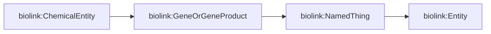

# This is PMA's DBGI daily open-notebook.

Today is 2024.01.09

## Todo today

### Have a look at the DBGI discussion forum
    - https://github.com/orgs/digital-botanical-gardens-initiative/discussions
###
###

## Doing

Meeting with Marco.

### Anticipated LOTUS

https://github.com/anticipated-lotus/GNN

Use of the biolink model (https://biolink.github.io/biolink-model/)

- We should specify the Taxonomic Rank both for molecular and taxon object.
- There is no found_in_taxon property in the biolink model.
In fact there is :: https://biolink.github.io/biolink-model/in_taxon/
It is linked to the WIKIDATA_PROPERTY:P703 
https://biolink.github.io/biolink-model/subclass_of/

We should clarify and better understand the following different problematic.

- We want to predict only biolink:in_taxon relations among nodes already present in the training graph.

- We want to predict biolink:in_taxon relations among nodes not present in the training graph.

Additionaly, we want to work at higher organisational level (higher taxonomic ranks) then the biological taxon and/or the molecular species. 
E.g. we want to predict the most probable chemical classes within Species A. 
E.g. we want to predict the most probable chemical classes within the genus of Species A. 

Marco's Query is somehow equivalent to the Scholia query https://query.wikidata.org/#%23%20tool%3A%20scholia%0A%23defaultView%3AGraph%0A%0APREFIX%20target%3A%20%3Chttp%3A%2F%2Fwww.wikidata.org%2Fentity%2FQ83310%3E%0A%0ASELECT%0A%20%20%3Fchild%20%3FchildLabel%0A%20%20%3Frgb%20%0A%20%20%3Fparent%20%3FparentLabel%0AWITH%20%7B%0A%20%20SELECT%20%3Fchild%20%3Frgb%20%3Fparent%20WHERE%20%7B%0A%20%20%20%20%7B%20%0A%20%20%20%20%20%20%23%20Parent%20taxa%0A%20%20%20%20%20%20SELECT%20%3Fchild%20%3Frgb%20%3Fparent%20%20WHERE%20%7B%0A%20%20%20%20%20%20%20%20SERVICE%20gas%3Aservice%20%7B%0A%20%20%20%20%20%20%20%20%20%20gas%3Aprogram%20gas%3AgasClass%20%22com.bigdata.rdf.graph.analytics.BFS%22%20%3B%0A%20%20%20%20%20%20%20%20%20%20%20%20%20%20%20%20%20%20gas%3Ain%20target%3A%20%3B%0A%20%20%20%20%20%20%20%20%20%20%20%20%20%20%20%20%20%20%23%20We%20should%20not%20do%20undirected%20here%20because%20this%20could%20result%0A%20%20%20%20%20%20%20%20%20%20%20%20%20%20%20%20%20%20%23%20in%20very%20big%20graphs.%0A%20%20%20%20%20%20%20%20%20%20%20%20%20%20%20%20%20%20gas%3AtraversalDirection%20%22Forward%22%20%3B%0A%20%20%20%20%20%20%20%20%20%20%20%20%20%20%20%20%20%20gas%3Aout%20%3Fchild%20%3B%0A%20%20%20%20%20%20%20%20%20%20%20%20%20%20%20%20%20%20gas%3Aout1%20%3Fdepth%20%3B%0A%20%20%20%20%20%20%20%20%20%20%20%20%20%20%20%20%20%20gas%3Aout2%20%3Fparent1%20%3B%0A%20%20%20%20%20%20%20%20%20%20%20%20%20%20%20%20%20%20gas%3AlinkType%20wdt%3AP171%20%3B%0A%20%20%20%20%20%20%20%20%7D%0A%20%20%20%20%20%20%20%20%3Fchild%20wdt%3AP171%20%3Fparent%20.%0A%20%20%20%20%20%20%20%20BIND(IF(%3Fchild%20%3D%20target%3A%2C%20%22FF0000%22%2C%20%22FFFFFF%22)%20AS%20%3Frgb)%0A%20%20%20%20%20%20%7D%0A%20%20%20%20%7D%0A%20%20%20%20UNION%20%0A%20%20%20%20%7B%0A%20%20%20%20%20%20%23%20Child%20taxa%0A%20%20%20%20%20%20SELECT%20%3Fchild%20%3Frgb%20%3Fparent%20WHERE%20%7B%0A%20%20%20%20%20%20%20%20BIND(target%3A%20AS%20%3Fparent)%0A%20%20%20%20%20%20%20%20%3Fchild%20wdt%3AP171%20%3Fparent%20.%20%0A%20%20%20%20%20%20%20%20BIND(%22DDDDDD%22%20AS%20%3Frgb)%0A%20%20%20%20%20%20%7D%0A%20%20%20%20%20%20LIMIT%20100%0A%20%20%20%20%7D%0A%20%20%7D%0A%7D%20AS%20%25results%0AWHERE%20%7B%0A%20%20INCLUDE%20%25results%20%0A%20%20%20%20%20%20%20%20%20%20%0A%20%20%3Fchild%20rdfs%3Alabel%20%3Fchild_label%20.%20FILTER(LANG(%3Fchild_label)%20%3D%20'en')%0A%20%20%3Fparent%20rdfs%3Alabel%20%3Fparent_label%20.%20FILTER(LANG(%3Fparent_label)%20%3D%20'en')%0A%20%20OPTIONAL%20%7B%0A%20%20%20%20%3Fchild%20wdt%3AP105%20%2F%20rdfs%3Alabel%20%3Fchild_rank_label%20.%20FILTER%20(LANG(%3Fchild_rank_label)%20%3D%20'en')%0A%20%20%7D%0A%20%20OPTIONAL%20%7B%0A%20%20%20%20%3Fparent%20wdt%3AP105%20%2F%20rdfs%3Alabel%20%3Fparent_rank_label%20.%20FILTER%20(LANG(%3Fparent_rank_label)%20%3D%20'en')%0A%20%20%7D%0A%20%20BIND(CONCAT(%3Fchild_label%2C%20%22%20-%20%22%2C%20COALESCE(%3Fchild_rank_label%2C%20%22%3F%3F%3F%22))%20AS%20%3FchildLabel)%0A%20%20BIND(CONCAT(%3Fparent_label%2C%20%22%20-%20%22%2C%20COALESCE(%3Fparent_rank_label%2C%20%22%3F%3F%3F%22))%20AS%20%3FparentLabel)%0A%0A%7D

Except that only the nodes with a taxon rank name are considered.

### EMI Portal

## Paused

## Done

## Notes

## Todo tomorrow, one day ... or never

###
###
###

## Today I learned that

-