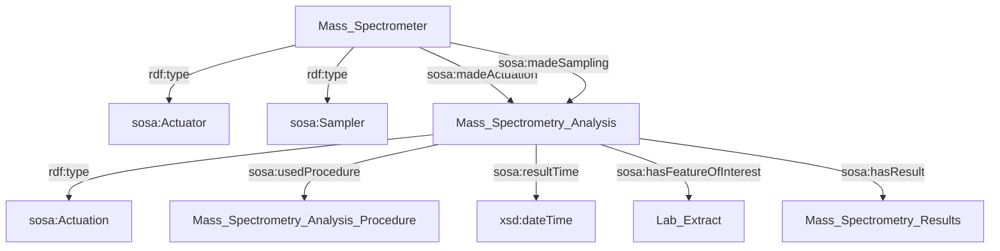
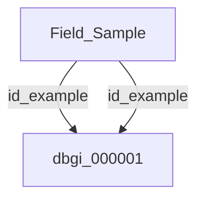

# This is PMA's DBGI daily open-notebook.

Today is 2023.09.22

## Todo today

### Have a look at the DBGI discussion forum
    - https://github.com/orgs/digital-botanical-gardens-initiative/discussions
###
###

## Doing

### Meeting Edouard

- MetaboBlitz / EMIBlitz
Vinesh Vineyards 

Think about coordination


- Directus + SampleTracking App

Directus is now up and working on the new Ubuntu 22. release

Edouard started working on Android studio 


Do a schema with all example of DBGI ids

- Information to capture in the SampleTracking App

At id issuing :

- Timestamp
- UUID


Think about experimental methods open repositaries.
Then Method 1 could have its DOI associated


List of tables to be implemented in DBGI DB

- Projects 

- Labels (currentky the Samples table)

This table collect the currently reserved and or used labels (corresponds to all printe labels untill now)

- Field_Samples

This table contains 


2 DB 

- EMI DB
- Project DB (DBGI DB)

Across project DB all headers should be identical.

We now work in [[EMI.rdb-tables]]





### Schema of an EMI overall procedure


```mermaid
graph TD
    subgraph field
    
    subgraph collection
		Collector -->|rdf:type|sosa:Sampler
		Collector -->|sosa:madeSampling|Field_Sampling["Field_Sampling"]
    Field_Sampling -->|rdf:type|sosa:Sampling["sosa:Sampling"]
    Field_Sampling -->|sosa:usedProcedure|Sampling_Procedure["Sampling_Procedure"]
    Field_Sampling -->|sosa:resultTime|fs_time["xsd:dateTime"]
    end 
    subgraph observation
		Smartphone -->|rdf:type|sosa:Sensor
		Smartphone -->|sosa:madeObservation|Field_Observation["Field_Observation"]
		Smartphone -->|sosa:observes|Pictures["Pictures"]
    Field_Observation -->|rdf:type|sosa:Observation["sosa:Observation"]
    Field_Observation -->|sosa:observedProperty|Pictures["Pictures"]
    Pictures --> |rdf:type|sosa:Observable_property["sosa:Observable_property"]
    Field_Observation -->|sosa:usedProcedure|Observation_Procedure["Observation_Procedure"]
    Field_Observation -->|sosa:resultTime|fo_time["xsd:dateTime"]
    Field_Observation -->|sosa:hasResult|iNaturalist_Observation["iNaturalist_Observation"]

    Field_Observation -->|"sosa:hasFeatureOfInterest"|Living_System["Living_System"]
    Field_Sampling -->|"sosa:hasFeatureOfInterest"|Living_System["Living_System"]
    Living_System -->|skos:narrower|t_a["ex:Taxon_a"]
    Living_System -->|skos:narrower|t_b["ex:Taxon_b"]
    end
    
    Lab_Extraction -->|"sosa:hasFeatureOfInterest"|Field_Sample["Field_Sample"]
    t_a -->|rdf:type|w["<a href=http://www.wikidata.org/entity/Q16521>wikidata:Q16521</a>"]
    t_b -->|rdf:type|w["<a href=http://www.wikidata.org/entity/Q16521>wikidata:Q16521</a>"]
    t_a -->|"emi:isClassifiedWith (optional)"|w2["Specimen Type Vocabulary"]
    t_b -->|"emi:isClassifiedWith (optional)"|w2["Specimen Type Vocabulary"]
    Field_Sampling -->|sosa:hasResult|Field_Sample["Field_Sample"]
    subgraph lab
    direction TB
    subgraph mass_spectrometry
		Mass_Spectrometer -->|rdf:type|MS_Actuator["sosa:Actuator"]
		Mass_Spectrometer -->|rdf:type|MS_Sampler["sosa:Sampler"]
		Mass_Spectrometer -->|sosa:madeActuation|Mass_Spectrometry_Analysis["Mass_Spectrometry_Analysis"]
		Mass_Spectrometer -->|sosa:madeSampling|Mass_Spectrometry_Analysis["Mass_Spectrometry_Analysis"]
    Mass_Spectrometry_Analysis -->|rdf:type|MS_Actuation["sosa:Actuation"]
    Mass_Spectrometry_Analysis -->|sosa:usedProcedure|Mass_Spectrometry_Analysis_Procedure["Mass_Spectrometry_Analysis_Procedure"]
    Mass_Spectrometry_Analysis -->|sosa:resultTime|ms_time["xsd:dateTime"]
    Mass_Spectrometry_Analysis -->|sosa:hasResult|Mass_Spectrometry_Results["Mass_Spectrometry_Results"]
    end
    subgraph extraction
		Extractor -->|rdf:type|sosa:Actuator
		Extractor -->|sosa:madeActuation|Lab_Extraction["Lab_Extraction"]
    Lab_Extraction -->|rdf:type|sosa:Actuation["sosa:Actuation"]
    Lab_Extraction -->|sosa:usedProcedure|Lab_Extraction_Procedure["Lab_Extraction_Procedure"]
    Lab_Extraction -->|sosa:resultTime|xsd:dateTime
    Lab_Extraction -->|sosa:resultTime|le_time["xsd:dateTime"]
    end
    Lab_Extraction -->|sosa:hasResult|Lab_Extract["Lab_Extract"]
    Mass_Spectrometry_Analysis -->|"sosa:hasFeatureOfInterest"|Lab_Extract["Lab_Extract"]
    end
```





## Paused

## Done

## Notes

## Todo tomorrow, one day ... or never

###
###
###


## Today I learned that

-