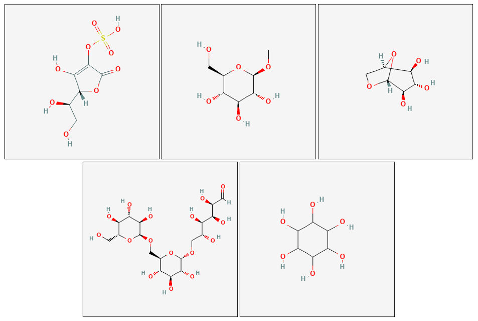

As results of this bachelor's work, a molecular network composed of 42 species and 110 samples has been created for a total of 14'563 nodes.

{max-height: 800px, max-width: 1400px, display: block, margin: 0 auto}
   _
Fig.D-01: Screenshot of the general molecular network present in the analysed samples of JBUF trees. The different colors represent the proportion of repartition of a certain compound across different organs._
   _Orange: Bark; Light green: Bud; Green: Flower; Turquoise: Fruit; Blue: Leaf; Light purple: Stems
_

{max-height: 400px, max-width: 1400px, display: block, margin: 0 auto}
_
Fig.D-02: Close up view of a cluster made out of different coumpounds found in the samples of JBUF trees. The different colors represent the proportion of repartition of a certain molecule across different organs_
_Orange: Bark; Light green: Bud; Green: Flower; Turquoise: Fruit; Blue: Leaf; Light purple: Stems
_

{max-height: 400px, max-width: 1400px, display: block, margin: 0 auto}
_
Fig.D-03: Chemical structure of a few compounds found in the network shown in the last figure
_

The content of the molecular network hasn't been finely studied, for it wasn't the goal of this project.

All the metadata used to produce such a network is accessible [here](https://github.com/digital-botanical-gardens-initiative/jbuf-trees/tree/main/docs/mapp_project_00067/mapp_batch_00174/metadata)

All the results can be found on [this Github repository](https://github.com/digital-botanical-gardens-initiative/jbuf-trees/tree/main/docs/mapp_project_00067/mapp_batch_00174/results)