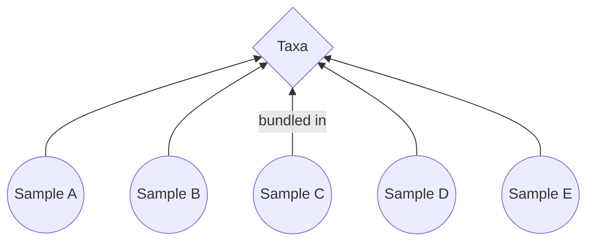
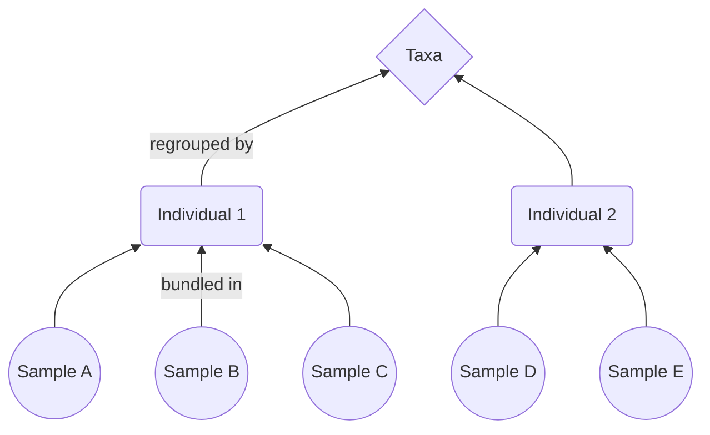
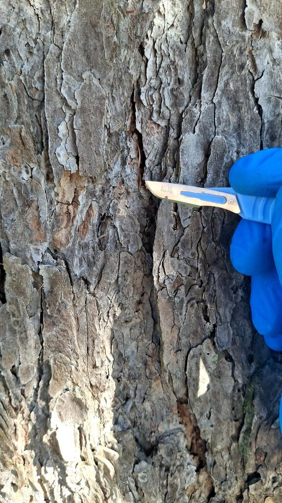
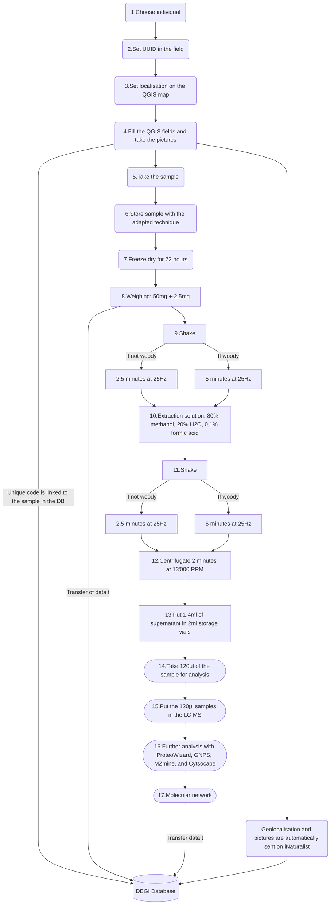

In this project, the already tested DBGI methodology will be applied on trees. They differ from precedently sampled plants as they bear lignified organs (bark, branches, pinecones, ...) which cannot be pulverised by the spherical metal beads used in the standard protocol. However, this nuisance might be overcome by using discoid beads instead.

So far, each sample wasn't considered as being linked to a peculiar specimen. They were considered independant from each other, even tho they came from the very same individual. As the samples were mostly leaves. This wasn't a big issue for not much more than a single sample was taken from the same indivudal.

_
Graphe C-01: Visual representation of the bundling of samples prior to the introduction of UUIds. There is no distinction of the origin of the samples.
_

_
Graphe C-02: Visual representation of the bundling of samples with UUIds. The original individual, source of the samples is known.
_

In this regard, trees offer an interesting challenge and an opportunity to further develop the EMI tools as they are perennial, and don't present all of their organs at the same time. Therefore, being able to attach samples to a specific individual could allow to come back to collect missing organs or study the modifications of the metabolome through the year(s).
To achieve this, Universally Unique Identifiers (UUIDs) transcribed in QR-codes were generated and attached to the specimen's panel. For now, ticks can be made at the back of the code to mark and follow the progression of the sampling on the specimen (Figure C-02).

{max-height: 500px, max-width: 500px, display: block, margin: 0 auto}
_
Fig.C-01: Front side of an UUID QR-code next to the panel of a sampled individual ...
_

{max-height: 500px, max-width: 500px, display: block, margin: 0 auto}
_
Fig.C-02: Back side of an UUID QR-code. The ticks show what organs already have been collected. Allowing to keep track of the progress 
_

Approximately 130 trees of the botanical garden have been sampled for this bachelor's work. They are scattered all over the garden, with a greater concentration in the arboretum, on the border of the system, and  near the outside fences  (Figure C-03). The JBUF is home to local species (_Picea abies_) aswell as tropical ones (_Persea americana_). 

_
Fig.C-03: Map of the JBUF. Most trees sampled were located around the edges of the Système (16) and in the Arboretum (17)
_

This work might show a strong bias toward gymnosperms as they tended to show a greater number of organs early in the year (this project took place from February to May).

### C_1 Sampling

  The classical DBGI methodology was applied to collect different organs. The main difference being the use of a standard secateurs, and a telescopic one to cut branches off.
  For each sample, the geographical position of the specimen is marked down on the JBUF QField map .
  At least 5 pictures must be taken for each sample:

  1) The whole specimen (Figure C-04).

  2) The identification panel with the UUID QR-code (Figure C-05).

  3) The identification panel with the UUID QR-code and the number of the sample (Figure C-06).

  4) Details of the plant (Figure C-07).

  5) The sampled zone indicated by the cutter (Figure C-08).

  6) Additional picture, if judged necessary.

  See an exemple for _Picea jezoensis_.
 
   {max-height: 500px, max-width: 500px, display: block, margin: 0 auto}
   _
Fig.C-04: General picture of Picea jezoensis
_

  {max-height: 500px, max-width: 500px, display: block, margin: 0 auto}
  _
Fig.C-05: Picture the UUID and panel of Picea jezoensis
_

  {max-height: 500px, max-width: 500px, display: block, margin: 0 auto}
  _
Fig.C-06: Picture of the UUID, the panel, and a sample code of Picea jezoensis
_

  {max-height: 500px, max-width: 500px, display: block, margin: 0 auto}
 _
Fig.C-07: Detailled picture of a branch, needles, and buds of Picea jezoensis
_

  {max-height: 500px, max-width: 500px, display: block, margin: 0 auto}
  _
Fig.C-08: The location of the sampling is indicated with the scalpel
_

  The different pictures and the geolocalisation of the sampled plants, are then imported on iNaturalist to confirm the belonging of the specimen to a species. This, allows the collectors to harvest large quantities of plant matter without having to be trained botanists themselves, speeding up the progression of the project and allowing for interesting citizen science initiatives.
  
  The organ must be separated from the parent organism. After the cut, the organ is wrapped in a brown coffee filter, and shoved in a falcon tube closed with a perforated cap. Each tube is pre-labeled with a unique number and QR-code which allows to identify and track the sample through its preparation and storage.
  The tubes are then temporarily submerged in liquid nitrogen.
  If they can't be freeze-dryed immediatelly, all tubes are stored in a -70°C freezer.

  ### C_2.  Extraction 

  The freeze-drying process needs to be at least 72 hours long to make sure the samples are absolutely dry. 
  Directly after the freeze-drying process, all the perforated caps need to be switched with standard, disinfected, non-perforated caps to avoid contamination from the environment. The falcon tubes are then scanned and stored in a labeled rack. From now on, the tubes will be stored in said racks to allow easy access to the samples if need be.
  The first step of the extraction process is the weighing. 50 mg needs to be weighted and inserted in a 2ml Eppendorf tube with a rounded bottom. 3 metal beads, or 3 disc beads if the sample is a needle or lignified, are added. An error up to 5% is accepted. To separate the tubes containing  normal beads from the discoids beads, the letter β is written on the tubes containing the discoid beads.

  The Eppendorf tubes then go in the MM40 Retsch machine (shaker) for 2.5 minutes at 25Hz for standard beads, and 5 minutes at 25Hz for the discoid beads. Then, 1,5ml of the DBGI extraction solution is added. Said solution is made of a mix of 80% methanol, 20% distilled water, and 0,1% formic acid. The newly rehydrated samples go back in the Retsch machine for a second round with the same settings.
  
  The tubes are then centrifugated for 2 minutes at 13'000 RPM to split the supernatant from the plant deposit which precipitates.

  Afterward, as much of the supernatant (usually 1,4ml) is collected and pipetted in a glass vial with a hermetically sealed cap (Figure C-08). Floating particles need to be avoided for they clogg the LC-MS.
  The vial needs to be labelled and associated to a container, ensuring the continued tracking of the sample from the garden to the freezer.
  The vials' container is then stored in a -70	°C freezer, and is ready for LC-MS and analysis.

 {max-height: 500px, max-width: 500px, display: block, margin: 0 auto}
  _
Fig.C-08 Glass vials with hermetically sealed cap containing the supernatant
_

  ### C_3.  Analysis

 Before using the, 120 microliters of the extracted liquid is pipetted from the hermetical vial to a new vial containing an insert to form an aliquot (Figure C-09). The vials are closed with a slitted cap which allows the machine to access the solution. These aliquots are the final step needed before analysing the samples through liquid chromatography-mass spectrometry (LCMS).
  
  {max-height: 500px, max-width: 500px, display: block, margin: 0 auto}
  
  _
Fig.C-09 Glass vials containing inserts and ready for analysis
_

### C_4. Sample Tracking & UUID
One of the key aspect of the DBGI is establishing and preserving linkage between the field and the database. Therefore, a reliable sample tracking system is necessary to keep track of the numerous samples for the entirety of their processing. As soon as a sample has been collected, a unique code is assigned to it. It will follow it through each stage of preparation, from extraction to storage by being reported on all containers the sample will go through. This allows to efficiently link the data, and the metadata of the sample into the database.

To go further in the labelling process, this Bachelor's project focuses on the introduction of Universally Unique IDentifiers (UUIDs), also known as Globally Unique IDentifier (GUIDs) in the established workflow. UUIDs are 128-bit labels used to uniquely identify objects in computer systems. They are excellent for the purpose of the EMI, as they don't need central authority, and can be generated in the field, even in the absence of internet connection.
Attributing the UUIDs to to sampled individuals adds an extra layer of information by giving it its own individuality. This is interesting as each individual differs in state and as such, in metabolomic contents. It allows the DBGI to be more precise in its metadata assignation. 

One important point to keep in mind is that other alternatives to UUIDs such as LSID, URN, HTTP URI, DOI, IGSN, ... exist and are used in different biocollections. The biodiversity community hasn't decided on a single method to use as of yet. No specific method prevails on the others [[(Guralnik et al., 2015)|Bachelor-Works.Simon-Rérat.H_References#^3p0q0bvyjtbc]], whith their own advantages and drawbacks.
As such, the method used by the DBGI to track individuals might change as time goes on.

_
 Graphe.C-03: Here is a cheat sheet of the different steps taken between the garden and the integration in the database
_
