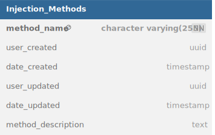

Injection_Methods table (*Figure 1*) permits to store the Mass spectrometry methods:
- method_name: Free format. Name of the method used to analyze samples through mass spectrometry. Automatically added during MS sample list creation. If the choosed method isn't present in the database, the software will add it.
- user_created, date_created_user_updated, date_updated: Informations about who created/modified the aliquots informations and when.
- method description: A description about the method. Has to be added manually in the [[Master-Works.Edouard-Brülhart.Services.Directus]] interface.

*Figure 1: Injection_Methods table structure*