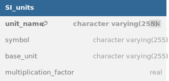

SI_units table (*Figure 1*) permits to store the SI units and to call them to indicate the units used for the different measurements:

- unit_name: The name of the unit. For example gram.

- symbol: symbol of the unit. For example g

- base_unit: base unit corresponding to this unit. For example kilogram for gram unit.

- multiplication_factor: multiplication factor that permits to pass to the base unit. For example 0.01 to pass from gram to kilogram.

*Figure 1: SI_units table structure*