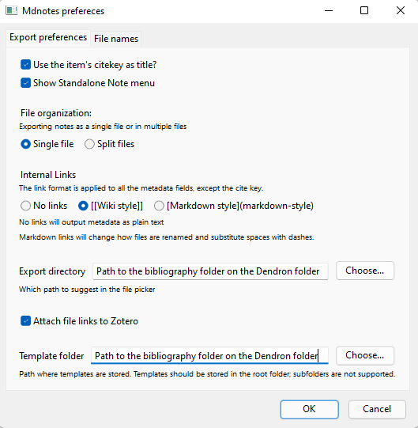

# How to use Zotero to create a bibliography on Dendron:

## Zotero installation and setup:
Zotero 5.0.95.1 or older (Mdnotes for Zotero is actually not working on more recent versions): https://zotero.en.uptodown.com/windows/versions

Now add the "dbgi-bibliography" shared folder on Zotero to access to all the Project references.

## Mandatory Zotero add-ons installation:
- Better BibTex for Zotero: https://retorque.re/zotero-better-bibtex/
- ZotFile: http://zotfile.com/
- Mdnotes for Zotero: https://github.com/argenos/zotero-mdnotes

Click on the link, download the add-on file, open Zotero, go to Tools -> Add-ons -> drag and drop the extension in the Add-ons Manager -> Install Now

## Set the add-ons settings:

### Better Bibtex for Zotero:
Go in Zotero to Edit -> Better BibteX and follow these settings:

### Zotfile:
Go in Zotero to Tools -> Zotfile Preferences... and follow these settings in the "Renaming Rules" tab:

### Mdnotes fo Zotero:
Go in Zotero to Tools -> Mdnotes preferences and follow these settings:

## References import on Dendron:
1) Just for the first import: Create a folder named "biblio" on your computer and replace "path to "biblio" folder" with the correct pass of the folder.

2) Go on Zotero, select the references to export, right click on it -> Better BibTeX -> Refresh BibTeX key -> right click -> Manage Attachments -> Rename and Move -> right click -> mdnotes -> Export to markdown. You now should have the references listed in the "biblio" folder in this format: "authorname_year.md".

3) To configure the import: Go to Visual Studio Code -> ctrl + shift + p -> Dendron: Configure Pod -> dendron.markdown import markdown. Then add the "biblio" folder path on the "src:" line and "vault" on the "vaultName:" line.

4) For the first and next imports, you just have to repeat the 2nd step and then go to Visual Studio Code -> press ctrl+shift+p -> Dendron: Import Pod -> dendron.markdown and your references present in the "biblio" folder will be imported in the Dendron.

Now you can add theses references in text ensured with double hooks.