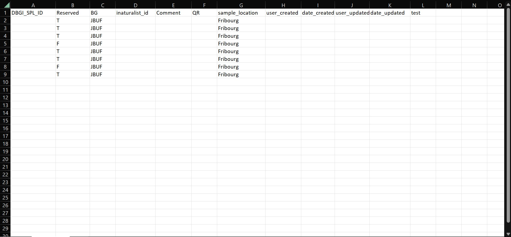
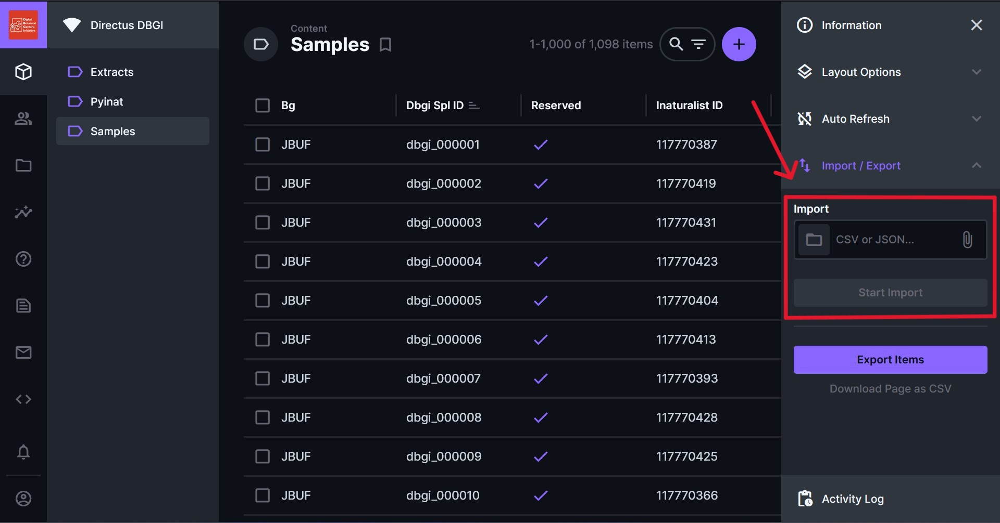

### How to add items to the samples table

1. Download the template or export the table as a csv from directus.
{max-width : 600px, display: block, margin: 0 auto}
{max-width : 600px, display: block, margin: 0 auto}

2. Fill the template with your data (no need to add the dbgi_spl_id,user_created,date_created,user_updated,date_updated - it is autoincremented)
{max-width : 600px, display: block, margin: 0 auto}

3. Import the data on directus
{max-width : 600px, display: block, margin: 0 auto}
