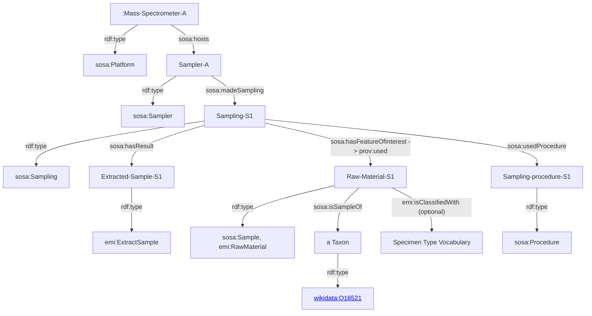
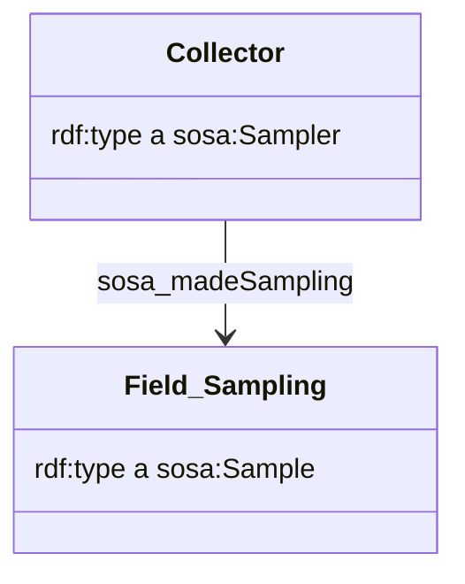

# Sandbox

[[emi-semantic-model]]

Working on the EMI semantic model at [[emi-semantic-model]]

Checking if the mermaid format used by Tarcisio can be used to draft the model directly in dendron notes

# Description of the SSN

https://www.w3.org/TR/vocab-ssn/#intro

https://github.com/w3c/sdw-sosa-ssn

> The Semantic Sensor Network (SSN) ontology is an ontology for describing sensors and their observations, the involved procedures, the studied features of interest, the samples used to do so, and the observed properties, as well as actuators. SSN follows a horizontal and vertical modularization architecture by including a lightweight but self-contained core ontology called SOSA (Sensor, Observation, Sample, and Actuator) for its elementary classes and properties. With their different scope and different degrees of axiomatization, SSN and SOSA are able to support a wide range of applications and use cases, including satellite imagery, large-scale scientific monitoring, industrial and household infrastructures, social sensing, citizen science, observation-driven ontology engineering, and the Web of Things. Both ontologies are described below, and examples of their usage are given.

## What is SOSA compared to SSN

> SOSA provides a lightweight core for SSN and aims at broadening the target audience and application areas that can make use of Semantic Web ontologies. At the same time, SOSA acts as minimal interoperability fall-back level, i.e., it defines those common classes and properties for which data can be safely exchanged across all uses of SSN, its modules, and SOSA.

## Modularization

This section appears convoluted for me (PMA).

A CHatGPT digest indicates

> In simple terms, this section talks about breaking down a complex set of rules and definitions (called an ontology) into smaller, more manageable parts to make it easier to use. Imagine it as dividing a big book into chapters, each with its own topic. There are two main ways to do this:
> 
> Vertical Segmentation: This is like dividing the book into chapters where each chapter builds on the previous one. For example, Chapter 2 builds on what you learned in Chapter 1. However, Chapter 1 doesn't need anything from Chapter 2. It's like a one-way street.
> 
> Horizontal Segmentation: This is like having chapters that depend on each other. Chapter 3 might need some information from Chapter 2 to make sense, and Chapter 2 might need something from Chapter 1. It's like a network of connections between chapters.
> 
> The goal of all this is to make it easier for different groups of people to use the rules and definitions (ontology) in a way that suits their needs. So, for example, one group might want to use a simplified version of the rules (like a summary of a book), while another group might want to use a more detailed version (like reading every page of the book). This helps different people work with the same set of rules but in ways that make sense to them.
> 

In any case it is clear the the SOSA is at the core of the SSN and has been build to be reused for other use cases than the ones initially envisioned. This makes it valuable in our case.

## Origins of SSN and SOSA

In the [Origins of SSN and SOSA](https://www.w3.org/TR/vocab-ssn/#Developments) we can read that 

> The initial SSN has been criticized for its partially inconsistent handling of virtual sensors (including software and simulations) and related classes and properties. The new SSN and SOSA address this issue by allowing all major classes to be virtual, and to better support humans and other animals as agents.
> 

This is great as it should allow us to model as sensors :

- humans (e.g. a Collector)
- machines (e.g a Mass Spectrometer)
- softwares (e.g. a Computational MS soft such as Sirius)

## Core terms and properties for SOSA

Overview of Classes and Properties
This section is non-normative.

- **Classes:** sosa:ActuatableProperty , sosa:Actuation , sosa:Actuator , sosa:FeatureOfInterest , sosa:ObservableProperty , sosa:Observation , sosa:Platform , sosa:Procedure , sosa:Result , sosa:Sample , sosa:Sampler , sosa:Sampling , sosa:Sensor
[Show all SOSA and SSN terms]

- **Object Properties:** sosa:actsOnProperty , sosa:madeByActuator , sosa:hasFeatureOfInterest , sosa:hasResult , sosa:hasSample , sosa:hosts , sosa:isActedOnBy , sosa:isFeatureOfInterestOf , sosa:isHostedBy , sosa:isObservedBy , sosa:isResultOf , sosa:isSampleOf , sosa:madeActuation , sosa:madeBySampler , sosa:madeBySensor , sosa:madeObservation , sosa:madeSampling , sosa:observedProperty , sosa:observes , sosa:phenomenonTime , sosa:usedProcedure
[Show all SOSA and SSN terms]

- **Datatype Properties:** sosa:hasSimpleResult , sosa:resultTime

### Observation perspective

### Actuation perspective

### Sampling perspective

Trying Mermaid class diagramm (https://mermaid.js.org/syntax/classDiagram.html) as these representation start to look crowded

