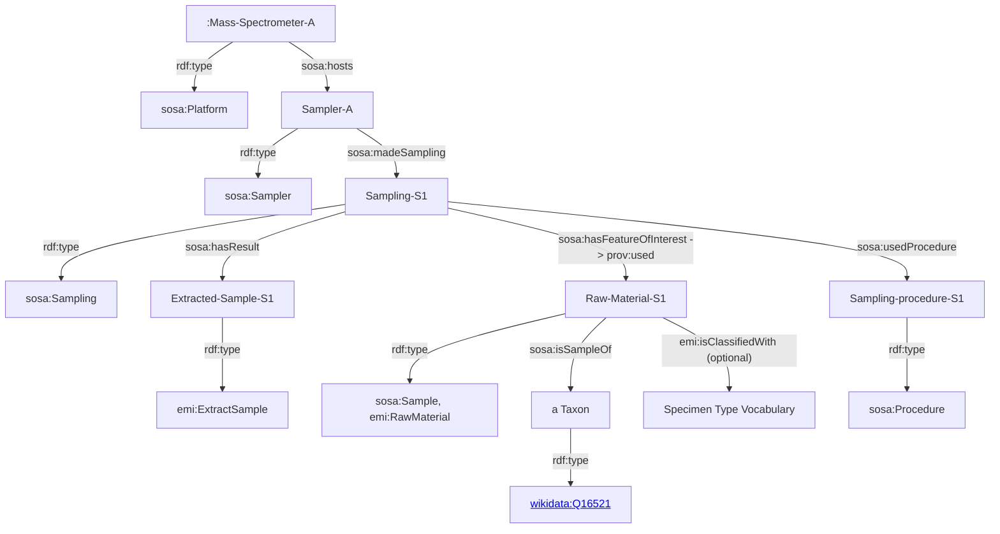

# This is PMA's DBGI daily open-notebook.

Today is 2023.09.01

## Todo today

### Have a look at the DBGI discussion forum
    - https://github.com/orgs/digital-botanical-gardens-initiative/discussions
###
###

## Doing

[[emi-semantic-model]]

Working on the EMI semantic model at [[emi-semantic-model]]

Checking if the mermaid format used by Tarcisio can be used to draft the model directly in dendron notes

https://www.w3.org/TR/vocab-ssn/#intro

https://github.com/w3c/sdw-sosa-ssn

The Semantic Sensor Network (SSN) ontology is an ontology for describing sensors and their observations, the involved procedures, the studied features of interest, the samples used to do so, and the observed properties, as well as actuators. SSN follows a horizontal and vertical modularization architecture by including a lightweight but self-contained core ontology called SOSA (Sensor, Observation, Sample, and Actuator) for its elementary classes and properties. With their different scope and different degrees of axiomatization, SSN and SOSA are able to support a wide range of applications and use cases, including satellite imagery, large-scale scientific monitoring, industrial and household infrastructures, social sensing, citizen science, observation-driven ontology engineering, and the Web of Things. Both ontologies are described below, and examples of their usage are given.

## Paused

## Done

## Notes

## Todo tomorrow

###
###
###

## Today I learned that

-